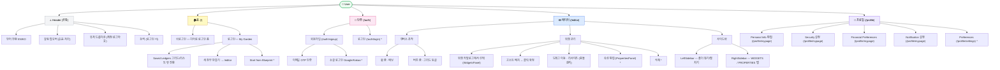

# UseCase Diagram
> `*` = 미구현 / 2026-04 기준

```mermaid
graph TD
    U(["👤 User"])

    U --> HDR["🔝 Header (공통)"]
    U --> H["🏠 홈 (/)"]
    U --> AUTH["🔐 인증 (/auth)"]
    U --> E["✏️ 에디터 (/editor)"]
    U --> P["👤 프로필 (/profile)"]

    %% Header
    HDR --> HDR1["언어 전환 EN/KO"]
    HDR --> HDR2["알림 팝오버 (읽음 처리)"]
    HDR --> HDR3["유저 드롭다운 (계정·로그아웃)"]
    HDR --> HDR4["검색 (로그인 시)"]

    %% 홈
    H --> H_OUT["비로그인 — 히어로·로그인 폼"]
    H --> H_IN["로그인 — My Garden"]
    H_IN --> H_IN1["Saved Ledgers 그리드/리스트 뷰 전환"]
    H_IN --> H_IN2["새 장부 만들기 → /editor"]
    H_IN --> H_IN3["Start from Blueprint *"]

    %% 인증
    AUTH --> A1["회원가입 (/auth/signup)"]
    AUTH --> A2["로그인 (/auth/login) *"]
    A1 --> A1a["이메일 OTP 인증"]
    A1 --> A1b["소셜 로그인 Google/Kakao *"]

    %% 에디터
    E --> E1["캔버스 조작"]
    E --> E2["위젯 관리"]
    E --> E3["사이드바"]

    E1 --> E1a["휠 줌 · 패닝"]
    E1 --> E1b["버튼 줌 · 그리드 토글"]

    E2 --> E2a["위젯 카탈로그에서 선택 (WidgetsPanel)"]
    E2 --> E2b["고스트 배치 → 클릭 확정"]
    E2 --> E2c["드래그 이동 · 리사이즈 (충돌 감지)"]
    E2 --> E2d["속성 편집 (PropertiesPanel) *"]
    E2 --> E2e["삭제 *"]

    E3 --> E3a["LeftSidebar — 폴더 접기/펼치기"]
    E3 --> E3b["RightSidebar — WIDGETS / PROPERTIES 탭"]

    %% 프로필
    P --> P1["Personal Info 편집 (/profile/mypage)"]
    P --> P2["Security 설정 (/profile/mypage)"]
    P --> P3["Financial Preferences (/profile/mypage)"]
    P --> P4["Notification 설정 (/profile/mypage)"]
    P --> P5["Preferences (/profile/settings) *"]

    style U    fill:#f0fdf4,stroke:#16a34a,color:#000
    style HDR  fill:#f3f4f6,stroke:#9ca3af,color:#000
    style H    fill:#fef9c3,stroke:#ca8a04,color:#000
    style AUTH fill:#fce7f3,stroke:#db2777,color:#000
    style E    fill:#dbeafe,stroke:#2563eb,color:#000
    style P    fill:#ede9fe,stroke:#7c3aed,color:#000
```
